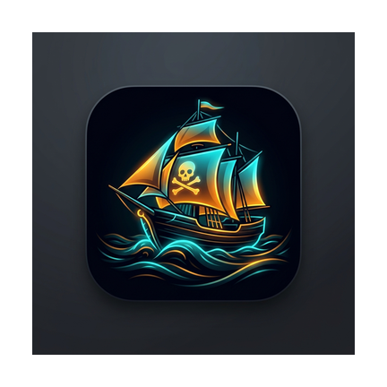

# 🏴‍☠️ 海盗湾安卓应用 (PirateBayApp)

<div align="center">



**一款现代、高效、美观的 The Pirate Bay (海盗湾) 移动端种子资源检索与磁力链接获取工具。**

[](https://www.android.com/)
[](https://kotlinlang.org/)
[](https://android-arsenal.com/api?level=24)
[](https://developer.android.com/topic/architecture)
[](LICENSE)

</div>

---

## ✨ 核心特性

- 🔍 **全网资源高速检索**：多备用域名自动 Fallback，保障在复杂网络环境下的可用性。
- 🏆 **Top 100 热门风向标**：支持按全站及各类子频道一键查看最热门种子排行。
- 🏷️ **横向滑动分类胶囊 (Material Chips)**：单手拇指轻滑即刻切换“电影视频、音乐音频、应用程序、游戏娱乐、其他”。
- ⚡ **现代自适应排序组件**：支持时间、文件大小、做种数的多维度升降序筛选，弹窗单选清晰直观，杜绝控件挤压截断。
- 🌐 **条目级智能标题翻译**：支持中英文一键无缝互译，翻译状态深度内聚至数据实体，滑动与重排永不乱序。
- 🧲 **一键联动外部 BT 下载器**：点击卡片可直接调用已安装的客户端（手机迅雷、Flud、1DM 等），无缝衔接下载流程；长按或点击可快速复制磁力。
- 🎨 **全新「深海极光 · Cyber Ocean」UI**：通透有呼吸感的深海绀青底色、微徽章化数据排版、彻底解决所有字体的基线与垂直截断问题。
- ⛵ **专属自适应海盗船图标 (Adaptive Icon)**：支持全套 Android 图标分辨率，完美契合各类启动器。

---

## 🏛️ 技术栈与现代架构

本项目经过系统级重构，严格遵循 Google Android 现代应用架构指南（Modern Android Development）：

- **编程语言**：100% [Kotlin](https://kotlinlang.org/)
- **架构模式**：**MVVM (Model-View-ViewModel)**
  - `MainViewModel` 托管统一的响应式状态流 `StateFlow<UiState>`，实现单一数据源（Single Source of Truth）。
  - 支持横竖屏旋转、暗黑模式切换等配置变更，界面与搜索状态完好保留。
- **异步处理**：Kotlin Coroutines (协程)，生命周期与 `viewModelScope` 深度绑定，消除内存泄漏。
- **列表与视图**：
  - 全面使用 **ViewBinding**，移除低效且容易空指针的手写 `findViewById`。
  - 继承自 **`ListAdapter`** 搭配 **`DiffUtil`** 计算差量，翻译与增删仅做微量局部更新，拒绝全局闪烁。
- **网络与解析**：
  - [OkHttp 4](https://square.github.io/okhttp/)：底层高并发 HTTP/HTTPS 网络引擎。
  - [JSONObject / JSONArray](https://developer.android.com/reference/org/json/JSONObject)：原生零开销 JSON 解析。
- **工程安全规范**：
  - 敏感第三方 API 密钥（如百度翻译凭证）完全与源码解耦，通过 `local.properties` 读取并在构建期经由 Gradle `BuildConfig` 注入，杜绝代码泄露。

---

## 📂 项目结构

```
PirateBayApp/
├── app/
│   ├── src/main/
│   │   ├── java/com/piratebay/app/
│   │   │   ├── MainActivity.kt          # 响应式主界面 (ViewBinding + Flow收集)
│   │   │   ├── MainViewModel.kt         # MVVM 状态与业务管理中心
│   │   │   ├── model/
│   │   │   │   └── TorrentItem.kt       # 结构化种子实体 (含 infoHash、原始数值与内聚状态)
│   │   │   ├── network/
│   │   │   │   ├── TPBScraper.kt        # 海盗湾 API 客户端 (含 Fallback 容灾)
│   │   │   │   └── TranslationService.kt# 翻译服务 (基于 BuildConfig 安全注入)
│   │   │   └── adapter/
│   │   │       └── TorrentAdapter.kt    # ListAdapter + DiffUtil 高性能列表适配器
│   │   ├── res/
│   │   │   ├── drawable/                # 胶囊背景、徽章标签与水波纹资源
│   │   │   ├── layout/                  # Activity 与卡片布局 (已彻底修复截断问题)
│   │   │   ├── mipmap-*/                # 全套各密度专属破浪海盗船图标
│   │   │   └── values/                  # 深海极光色系、主题与字符串资源
│   │   └── AndroidManifest.xml
│   └── build.gradle.kts                 # 启用 BuildConfig、ViewBinding 并注入属性
├── local.properties.example             # 本地环境配置模板
├── gradle.properties                    # 开启 UTF-8 与路径检查兼容
└── README.md
```

---

## 🚀 构建与运行说明

### 前置要求

- Android Studio Hedgehog (2023.1.1) 或更高版本
- JDK 17 (推荐 Microsoft OpenJDK 17 或 Eclipse Adoptium Temurin 17)
- Android SDK 34 (minSdkVersion: 24)

### 配置凭证 (可选)

项目支持通过百度翻译 API 为种子标题提供中英文翻译。若需开启翻译能力：

1. 参考 `local.properties.example`，在项目根目录下创建或编辑 `local.properties`：
   ```properties
   BAIDU_APP_ID=你的百度翻译AppId
   BAIDU_SECRET_KEY=你的百度翻译密钥
   ```
2. 该文件已被 `.gitignore` 保护，不会被提交到远程版本库。若不配置，搜索与磁力获取功能仍可正常使用。

### 命令行打包 APK

```bash
# Windows
.\gradlew.bat assembleDebug

# Linux / macOS
./gradlew assembleDebug
```

构建生成的 APK 位于：`app/build/outputs/apk/debug/app-debug.apk`。

---

## 📝 使用指南

1. **资源搜索**：在顶部胶囊输入框输入关键词，点击“搜索”或软键盘回车，键盘将自动收起并展示结果。
2. **分类筛选**：横向轻滑分类标签栏，点击任一分类（如“🎬 电影视频”），即刻按分类精准过滤。
3. **多维排序**：点击右侧“⚡ 默认排序 ▾”胶囊，在弹窗中任选“最新发布”、“体积最大”、“最多做种”等，列表将按数值极速重排。
4. **标题翻译**：点击条目右上角“翻译”胶囊，即可异步获取中文译名；再次点击即可还原原文。
5. **获取磁力**：
   - **点击卡片**：自动尝试唤起本机安装的 BT 客户端（迅雷、Flud 等）；若未安装则自动将磁力链接复制到剪贴板。
   - **复制 / 分享**：点击“复制磁力链接”按钮或长按卡片快速复制；点击“分享”按钮通过系统分享菜单发送给好友。

---

## ⚠️ 免责声明

- 本项目仅供移动端技术交流、架构演进与学习研究使用。
- 检索服务依赖公共公开网络接口，应用本身不存储任何种子资源内容。
- 请在遵守当地法律法规的前提下合理使用。

---

## 📄 许可证

本项目基于 [MIT License](LICENSE) 开源。
